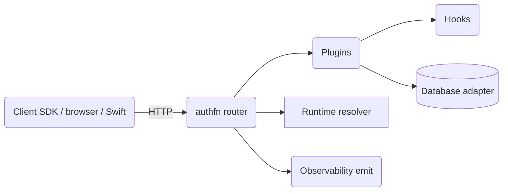

# Core Concepts

authfn is small at the core. Everything you'll do — adding a sign-in method, switching databases, deploying to multiple regions, integrating with your audit pipeline — composes from these primitives. Read this section once when you adopt authfn, and revisit individual pages when you need to reason about a specific subsystem.

## Mental model

- **The router** is a framework-agnostic dispatcher. You mount it through one of the `@superfunctions/http-*` adapters.
- **Plugins** contribute routes, schema tables, hooks, and OpenAPI surface. Every sign-in method is a plugin.
- **Hooks** are user-defined callbacks fired at well-known lifecycle points: `beforeUserCreate`, `afterSessionIssue`, `beforeOAuthStart`, `afterAccountDelete`, etc.
- **The database adapter** is your storage backend. authfn never reaches for a specific ORM or driver; it speaks the `@superfunctions/db` contract.
- **The runtime resolver** decides per-request configuration — base URL, issuer, OAuth credentials, cookie domain — based on the host, region, or any custom logic.
- **Observability** is a single `emit(event)` callback. Every meaningful action emits a structured event with redaction baked in.

## Sections

### Architecture & data model

- [Architecture](./architecture) — how kernel, plugins, hooks, runtime, and storage fit together.
- [Sessions](./sessions) — cookie sessions, token sessions, rotation, idle/absolute timeout, multi-device.
- [Cookies](./cookies) — names, prefixes, `Domain`, `Secure`, `SameSite`, path scoping, rotation, multi-region.
- [CSRF](./csrf) — double-submit token model, what's protected, custom origins.

### Contract surface

- [Envelopes](./envelopes) — every HTTP response wraps either `{ ok: true, data, requestId }` or `{ ok: false, error, requestId }`.
- [Errors](./errors) — every error code, status, retryability, and what to display.
- [OpenAPI](./openapi) — how the document is generated and what it includes.

### Composition

- [Plugins](./plugins) — lifecycle, ordering, configuration, schema, authoring custom plugins.
- [Hooks](./hooks) — `beforeUserCreate`, `afterSessionIssue`, and the rest of the surface.
- [Runtime resolver](./runtime) — per-request issuer, base URL, OAuth, cookie domain.
- [Account linking](./account-linking) — when authfn merges OAuth identities and OTP signups into existing users.

### Operations

- [Regions](./regions) — multi-region lookup, runtime overlays, wrong-authority correction, and placement-bound downstream context.
- [Observability](./observability) — every event that fires, request correlation, redaction.
- [Rate limiting](./rate-limiting) — what's covered, where to add limits.
- [Security](./security) — threat model, what authfn defends against, what it doesn't, your responsibilities.
