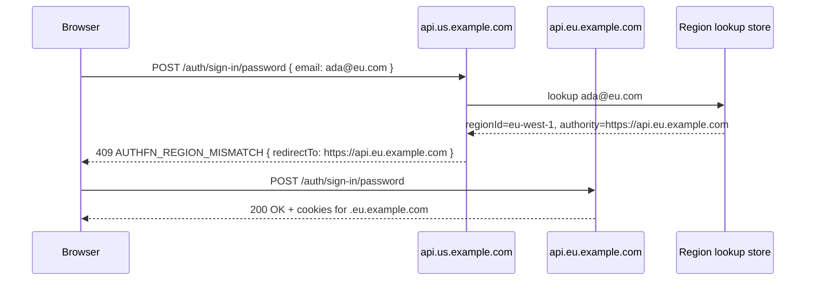

# Multi-region routing

Multi-region authfn is the answer to: *"My EU users' data must stay in the EU. My US users' data lives in the US. How do I keep authentication correct when traffic enters through one public authority?"*

AuthFn supports two explicit modes:

| Mode | Public authority | Routing behavior | Compatibility |
| --- | --- | --- | --- |
| `direct` (default) | One authority per region | The client looks up a region, receives `AUTHFN_REGION_MISMATCH`, and continues on the regional authority. | Existing regional clients and deployments are unchanged. |
| `gateway` | One canonical authority | A trusted gateway derives an identity key, reads canonical placement, and forwards internally to the owning cell. Regional topology is never returned to the client. | New deployments opt in; there is no silent fallback from gateway to direct mode. |

In gateway mode the configured `publicAuthority` is always the issuer and base URL. OAuth redirect URIs, discovery metadata, cookie scope, browser origins, and native handoff return paths therefore remain stable while execution moves between cells. The selected cell still receives a private `regionId` for database and residency policy.

The placement directory is deliberately separate from the existing identifier lookup projection. Its atomic record is `{ identityKey, regionId, epoch, state }`; only `active` records execute. `moving` records fence writes and `tombstoned` records fail closed. Cell destinations are opaque values returned by the cell registry and are never stored in placement or sent publicly.

In direct mode, enable the **`authFnMultiRegionPlugin`** and the kernel will:

1. Look up which region a user belongs to (by email or other identifier) before any sensitive operation.
2. Apply a region-specific runtime overlay (issuer, base URL, cookie domain, OAuth credentials).
3. If the request landed on the wrong authority, raise `AUTHFN_REGION_MISMATCH` with a `redirectTo` to the right authority.
4. Pin newly created users to the region they were created in.
5. Cache lookups so steady-state traffic is fast.

The plugin is *additive* — single-region authfn still works without it. You opt in only when you need region pinning.

## Concepts

### Region

A **region** is a logical pin: `us-east-1`, `eu-west-1`, …. Each region has:

- A regional **authority** — the URL where requests for that region should land (`https://api.us.example.com`, `https://api.eu.example.com`).
- An optional **cookie domain** — a region-scoped domain to bind sessions to.
- Optional region-specific **OAuth client IDs** and **issuer**.
- Optional region-specific **base URL** (often the same as the authority).

### Authority

A region's authority is a fully-qualified URL. authfn uses it to:

- Decide whether a request is on the right authority for the resolved user (`continueLocally`).
- Build redirect targets when the request lands on the wrong authority.

### Identifier

The lookup key. Today this is the user's primary email. The plugin normalizes (lowercases, trims) the identifier before the lookup.

### Region profile

A row in `authfn_region_profiles`. One per user. It records the user's pinned `regionId` and `authority`. Created on the user's first sign-up; updated only by privileged paths.

### Region lookup

Either a row in your **lookup store** (for example, a shared table that maps `email → region` and provides an atomic conditional insert through one writer/coordinator), or — when no lookup store is configured — derived by reading `authfn_users` + `authfn_region_profiles` from the local database.

## Configuring the plugin

```ts
import { authFnPlugins, authfn } from 'authfn';
import {
  authFnMultiRegionEnvironment,
  authFnMultiRegionPlugin,
} from '@authfn/multi-region';

const app = authfn({
  plugins: authFnPlugins(authFnMultiRegionPlugin()),
});

const environment = authFnMultiRegionEnvironment({
  defaultRegionId: 'us-east-1',
  regions: [
    {
      regionId: 'us-east-1',
      authority: 'https://api.us.example.com',
      hosts: ['api.us.example.com'],
      cookie: { domain: '.us.example.com' },
      oauth: { google: { clientId: process.env.GOOGLE_US_ID! } },
    },
    {
      regionId: 'eu-west-1',
      authority: 'https://api.eu.example.com',
      hosts: ['api.eu.example.com'],
      cookie: { domain: '.eu.example.com' },
      oauth: { google: { clientId: process.env.GOOGLE_EU_ID! } },
    },
  ],
  lookupStore,        // optional, externally-replicated lookup
});

const server = app.createServer({ database, environment });
```

## How a request flows

The diagram below describes `direct` mode. In `gateway` mode the browser talks only to the canonical authority; see [Canonical-gateway multi-region](../recipes/canonical-gateway-multi-region).



The browser (or `@authfn/client`) follows the `redirectTo`. The first-party SDKs handle this transparently.

## What's checked, when

The plugin enforces region alignment at every privileged entry point that has a known identifier:

| Surface | Action |
| --- | --- |
| `POST /auth/sign-in/password` | Look up `email`, throw `AUTHFN_REGION_MISMATCH` if the wrong authority. |
| `POST /auth/sign-up/password` | Look up `email`. If unknown, allow, then pin to the current region after success. |
| `POST /auth/otp/start` (sign-in / sign-up purposes) | Same — pre-route on the email. |
| `POST /auth/oauth/:provider/start` | Pre-route the configured `email_hint` if supplied. |
| `GET /auth/oauth/:provider/callback` | After the provider returns the email, pre-route. |
| Anything else | Use the runtime's `regionId` (no per-request lookup; trusts the resolver). |

## Pinning new users

When a user signs up in direct mode, authfn writes a `region_profiles` row with the region the request landed on. Gateway mode atomically claims an initial placement before the regional handler starts, so concurrent first-use requests cannot create identity state in two cells. Use `moveAuthFnIdentityPlacement` for a fenced gateway-mode move; no public move route is registered.

## Conflicts and races

If two regions both attempt to register the same email at the same time, the lookup store's `putIfAbsent` semantics decide a winner. The losing region throws `AUTHFN_REGION_MISMATCH` and emits an `authfn.region.lookup.conflict` event with the existing record's authority.

## Caching

Region lookups are cached when you supply a `cacheStore` to `createAuthFn`. The cache layer is shared with the rest of the kernel, so you only configure it once. Hits and misses use different TTLs:

- Hits: `regionHit` TTL (default 5 minutes).
- Misses: `regionMiss` TTL (default 1 minute) — short on purpose so newly-created users don't experience stale "no region" lookups.

Use a Redis-backed store for production; the in-memory KV store is fine for local development.

## What if no lookup store is configured?

Without a lookup store, the kernel falls back to reading `authfn_users` + `authfn_region_profiles` from the *local* database — which is fine if every region's database carries every user's region profile. For larger setups, configure a dedicated lookup store whose `setIfAbsent` operation is atomic across every writer. Replication alone, including local reads and writes against DynamoDB Global Table replicas, does not establish a globally atomic owner.

## Observability

The plugin emits:

- `authfn.region.lookup` — every successful region lookup. Carries `identifier`, `regionId`, `authority`.
- `authfn.region.lookup.conflict` — when a registration attempt loses a race.

Gateway deployments can additionally emit `authfn.routing.placement_lookup`, `authfn.routing.placement_claimed`, `authfn.routing.forwarded`, `authfn.routing.mismatch`, `authfn.routing.retry`, `authfn.routing.assertion_rejected`, `authfn.routing.directory_unavailable`, and `authfn.routing.cell_unavailable`. Alert on directory/cell availability, mismatch-retry exhaustion, and assertion rejection rather than logging identity keys or assertion contents.

Use these to track lookup latency, miss ratios, and conflict frequency.

## Schema

The plugin contributes one table:

| Table | Columns |
| --- | --- |
| `authfn_region_profiles` | `id`, `userId`, `regionId`, `authority`, `domain`, `createdAt`, `updatedAt` |

…plus your `lookupStore` schema (whatever shape you choose for the global lookup, typically `(identifier, userId, regionId, authority, domain, createdAt, updatedAt)`).

## Related

- [Plugins → Multi-region](../plugins/multi-region) — full plugin reference.
- [Runtime](./runtime) — how region overlays compose with `runtime.resolve`.
- [Cookies](./cookies) — region-scoped cookie domains.
- [Recipes → Multi-region deployment](../recipes/multi-region-deployment) — end-to-end walkthrough.
- [Recipes → Canonical-gateway multi-region](../recipes/canonical-gateway-multi-region) — signed cell forwarding.
- [Recipes → Placement-bound auth context](../recipes/placement-bound-auth-context) — trusted downstream routing context.
- [Examples → multi-region-routing](../examples/multi-region-routing) — runnable example.
