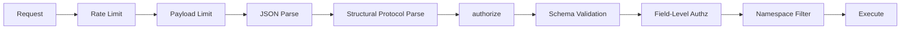

DataFn's security model is a sequence of independent checks. A request reaches the database only if it passes every layer in order. If any layer rejects, the request terminates immediately with a specific error code.



| Layer | What it does | Reject code |
| --- | --- | --- |
| [Rate limit](/docs/documentation/security/rate-limiting) | Drop request floods before any parsing | `429` (no envelope; transport-level) |
| [Payload limit](/docs/documentation/security/payload-limits) | Reject oversized bodies | `LIMIT_EXCEEDED` |
| JSON parse | Reject malformed bodies before auth | `DFQL_INVALID` |
| [Structural selectors](/docs/documentation/security/resource-selectors) | Derive protocol resource names for `authorize` and gateway routing | `DFQL_INVALID` / `DATAFN_UNSUPPORTED_PROTOCOL_VERSION` |
| [`authorize`](/docs/documentation/security/request-authz) | Coarse-grained "is this caller allowed to do this kind of action" | `FORBIDDEN` |
| Schema validation | Validate the DFQL against the schema | `DFQL_INVALID` / `DFQL_UNKNOWN_*` |
| [Field-level authz](/docs/documentation/security/field-level-authz) | Per-field `permissions` policy on each resource | `FORBIDDEN` |
| [Namespace filter](/docs/documentation/security/namespace-isolation) | Row-level isolation for multi-tenancy | (transparent — rows just don't return) |
| Execute | Hit the database | — |

The server parses structural protocol selectors before authorization and rejects unsupported versions. Schema and operation validation follows authorization. REST wrappers derive their structural resource from the URL; record fields are not selectors.

## Design principles

- **Independent layers**: each layer is unaware of the others. A bug in one cannot bypass the next.
- **Order matters**: rate limit before parse, parse before authz, authz before validation. This is why `429` and `LIMIT_EXCEEDED` happen before `FORBIDDEN`.
- **Deny by default**: resources without a `permissions` policy are forbidden. There is no "default allow" in production.
- **Server-derived identity**: the actor and namespace come from server-side context (your auth middleware), never from the request body.
- **No information leakage in production**: with `debug: false`, error messages drop field names, schema details, and resource names.

## Quick wins

Three settings prevent the vast majority of security issues:

```typescript
const datafn = await createDatafnServer({
  schema, db,
  authorize: async (ctx) => Boolean(ctx.session?.userId),  // require auth
  namespaceProvider: { getNamespace: (ctx) => ns(ctx.session.orgId) }, // tenant isolation
  debug: false, // production error messages
  // Plus per-resource `permissions` in your schema.
});
```

See [Production Checklist](/docs/documentation/security/production-checklist) for the comprehensive list.
