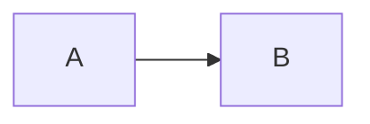

# Content Format

docsfn uses **Markdown** (`.md` or `.mdx` where enabled) with **YAML frontmatter** plus per-directory **`meta.json`** files to control navigation. The **native** preset is `compat.preset: "none"` (no Fumadocs transform).

## Standard Markdown

### Headings

Use `#` … `######` for hierarchy. Headings feed the in-page **table of contents** when exposed by your layout.

### Paragraphs and emphasis

Blank lines separate paragraphs. Use `**bold**`, `*italic*`, and `` `inline code` `` as usual.

### Lists

- **Unordered** — `-` or `*` items.
- **Ordered** — `1.` numbered items.
Indent nested lists with two spaces.

### Code blocks

Fenced blocks with an optional language tag:

````markdown
```typescript
const x = 1;
```
````

### Tables

```markdown
| Column A | Column B |
| --- | --- |
| foo | bar |
```

### Links and images

```markdown
[Label](/docs/path)

```

Paths are usually absolute from the site origin or relative to your asset hosting rules.

---

## docsfn Markdown extensions

### Callouts

GitHub-style callouts in blockquotes:

```markdown
> [!NOTE]
> Supplementary information.

> [!TIP]
> Helpful suggestion.

> [!WARNING]
> Caution.

> [!INFO]
> Neutral info.

> [!CAUTION]
> Risk or breaking behavior.
```

### Mermaid

````markdown

````

Rendering depends on your app (client-side Mermaid, build step, or server diagram service).

### Tabs

Fenced tab groups (values and panels are parsed by `@docsfn/core`):

```markdown
<DocsTabs>
  <Tab value="npm">npm install @docsfn/core</Tab>
  <Tab value="pnpm">pnpm add @docsfn/core</Tab>
</DocsTabs>
```

(Component names may be `Tabs` / `Tab` in some configs; align with your `compileSvelteContent` / compat preset.)

### Component blocks

Custom `<ComponentName>...</ComponentName>` blocks are represented as **component** segments in the compiled artifact; your UI layer supplies renderers or falls back to placeholders.

---

## Frontmatter (YAML)

Common fields on doc and blog pages:

| Field | Role |
| --- | --- |
| `title` | **Required** for meaningful pages — page title and default nav label. |
| `description` | SEO + search summary. |
| `draft` | When true, exclude from production listings/search where implemented. |
| `tags` | Array of strings (blog, some indexes). |
| `date` | ISO date string for blog ordering. |
| `author` | Display string. |
| `version` | Optional version slug when using versioned docs. |

Example:

```yaml
---
title: Page title
description: One line for SEO
draft: false
tags: [release, docsfn]
date: 2026-03-22
author: 21n
---
```

Private or auth-gated content may use additional keys interpreted by `@docsfn/core` / your adapter.

---

## `meta.json` structure

Each docs subdirectory may include a **`meta.json`** (name overridden by `content.metaFileName`).

| Field | Type | Description |
| --- | --- | --- |
| `title` | string | Section title in the sidebar. |
| `pages` | array | Ordered list of child pages. |
| `root` | boolean | When true, flattens or promotes the section (see navigation builder behavior). |

### `pages` entries

- **String** — slug key matching a file stem, e.g. `"quick-start"` → `quick-start.md`.
- **Object** — `{ "key": "subdir", "label": "Custom label", "icon": "optional", "hidden": true }`
  - `hidden: true` removes the item from visible nav while keeping routes if files exist.
  - `icon` is passed through to UI layers that support icons.

Example:

```json
{
  "title": "Getting Started",
  "pages": [
    "index",
    "installation",
    { "key": "advanced", "label": "Advanced" }
  ]
}
```

**Strictness:** every referenced key must correspond to real content; unknown keys produce **DOCS_META_INVALID** at build time.

---

## File naming

- Use **`.md`** (or supported MDX where applicable).
- Name section roots **`index.md`** so the directory maps to a single URL segment.
- Prefer **kebab-case** filenames for slugs (`quick-start.md`).

---

## Directory → URL mapping (docs collection)

1. `content.root` + `content.docsDir` defines the docs tree root on disk.
2. Each file becomes a **slug** from its path relative to that root (without extension).
3. URLs are prefixed with **`site.basePath`**.
4. Example: `content/docs/guides/setup.md` → slug like `guides/setup` → URL `/docs/guides/setup` (exact rules follow manifest normalization in `@docsfn/core`).

Blog and **api** collections use separate directories and routing conventions.

---

## Collection types

| Collection | Typical directory | Contents |
| --- | --- | --- |
| **docs** | `content/docs` | Conceptual documentation Markdown. |
| **pages** | `content/pages` (configurable) | Extra Markdown pages outside the main doc tree. |
| **blog** | `content/blog` | Dated posts, RSS, listings. |
| **api** | `content/api` | OpenAPI **JSON/YAML** only. |
| **assets** | `static` / `public` | Binary/static files. |

Hand-written API Markdown can still live under the **docs** collection (for example `content/docs/api/overview.md`). Those files keep normal docs semantics, but you can intentionally classify `/docs/api...` routes into the **api** sidebar and search scope with `navigation.sidebars.api.include` and `search.routeScopeOverrides`.

For configuration details, see [Configuration](./configuration).
