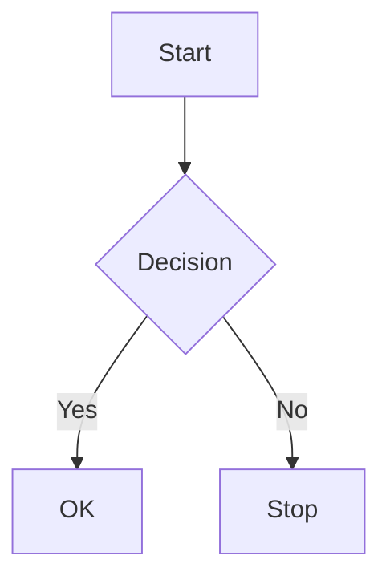

# Markdown extensions

docsfn parses Markdown into a **`CompiledContentArtifact`**: a list of **`CompiledContentBlock`** values your Svelte/React layer renders.

See also: [Content format](./content-format), [Diagnostics](./diagnostics) (`DOCS_HTML_UNSAFE`, `DOCS_COMPAT_UNSUPPORTED`).

## Callouts

GitHub-style alerts in blockquotes:

```markdown
> [!NOTE]
> Supplementary detail.

> [!TIP]
> Helpful suggestion.

> [!WARNING]
> Risk or breaking behavior.

> [!INFO]
> Neutral context.

> [!CAUTION]
> Stronger warning than WARNING for safety or data loss.
```

Parser regex: line starts with `>`, optional space, `[!KIND]`, rest of line + following `>` continuation lines become **`type: "callout"`** with **`kind`** `note` | `tip` | `warning` | `info` | `caution`.

## Mermaid

Fenced code with language **`mermaid`** becomes **`type: "mermaid"`** with the raw diagram source:

````markdown

````

Rendering uses your app’s Mermaid integration on the client or SSR. Common diagram types (`graph`, `sequenceDiagram`, `classDiagram`, etc.) follow Mermaid’s own parser support.

## Tabs

Tabs blocks use **`DocsTabs`** / **`DocsTab`** (or **`Tabs`** / **`Tab`** with **`compat.preset: "fumadocs-v15"`**, which rewrites to DocsTabs during transform).

Illustrative structure (place in Markdown as raw HTML-like tags—see compat note below):

```text
DocsTabs items="npm,pnpm,yarn"
  DocsTab value="npm"
  npm install @docsfn/core
  /DocsTab
  DocsTab value="pnpm"
  pnpm add @docsfn/core
  /DocsTab
/DocsTabs
```

Replace `DocsTabs`/`DocsTab` with angle-bracket tags in real content; **`items`** can be parsed from attributes for default tab order.

## Code blocks

Standard fenced blocks become **`type: "code"`** with optional **`lang`** for syntax highlighting in your renderer. Any language string is accepted; highlighter support depends on the UI layer.

## Custom components

PascalCase tags parse as **`type: "component"`** with **`name`**, optional **`body`**, and **`selfClosing`**. Example pattern: `ComponentName prop="value"` … `ComponentName` with inner Markdown.

Your site supplies renderers for known components or falls back to placeholders.

## Compiled block types (summary)

| `type` | Meaning |
| --- | --- |
| `heading` | TOC + anchors. |
| `paragraph` | Plain text paragraph. |
| `list` | Ordered or unordered list with item texts. |
| `code` | Fenced code (non-mermaid). |
| `mermaid` | Diagram source. |
| `tabs` | Tab metadata + per-tab content strings. |
| `callout` | Alert kind + text. |
| `table` | HTML table from Markdown pipe-table syntax. |
| `component` | Custom component segment. |

## Fumadocs compatibility

Preset **`fumadocs-v15`** maps `Tabs`→`DocsTabs` and tracks usage for compat diagnostics. Unsupported constructs raise **`DOCS_COMPAT_UNSUPPORTED`** where applicable.
