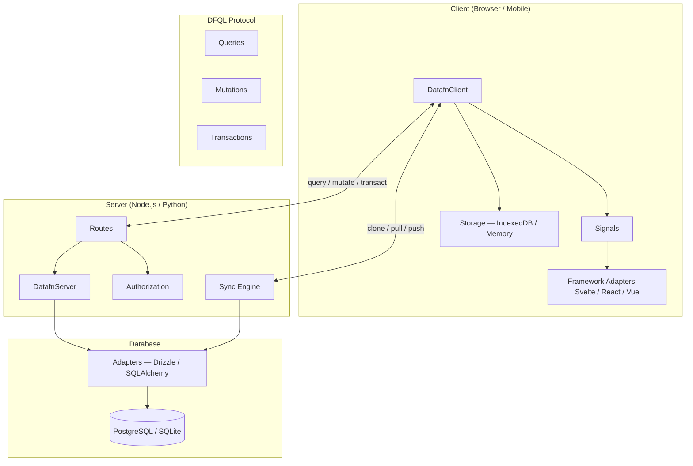

DataFn is a full-stack, offline-first data management framework for TypeScript applications. It connects a reactive client to a server-side runtime through a structured query language, with automatic synchronization and multi-tenancy built in.

## DFQL

**DataFn Query Language** is the structured JSON-based protocol that both the client and server use to describe data operations.

DFQL covers:

- [**Schema**](/docs/dfql/schema) — define your data model with typed resources, fields, indices, and relations.
- [**Capabilities**](/docs/documentation/concepts/capabilities) — opt-in lifecycle and access behavior (`timestamps`, `audit`, `trash`, `archivable`, `shareable`).
- [**Resources**](/docs/dfql/schema/resources) — declare collections of records with versioning, permissions, and index configuration.
- [**Fields**](/docs/dfql/schema/fields) — configure field types, validation constraints, defaults, and encryption.
- [**Relations**](/docs/dfql/schema/relations) — define one-to-many, many-to-many, and hierarchical tree relationships.
- [**Queries**](/docs/dfql/queries) — read data with filters, sorting, pagination, field selection, and aggregations.
- [**Mutations**](/docs/dfql/mutations) — insert/merge/replace/delete plus capability operations (`trash`, `restore`, `archive`, `unarchive`, `share`, `unshare`).
- [**Transactions**](/docs/dfql/transactions) — execute multiple operations atomically.

## Client

The [**DataFn client**](/docs/documentation/client/setup) (`@datafn/client`) runs in the browser or Node.js and provides:

- **Reactive signals** — subscribe to query results that auto-refresh on mutations. See [Signals](/docs/documentation/client/signals).
- **Offline-first storage** — read and write data locally with IndexedDB or in-memory adapters. See [Storage](/docs/documentation/storage/overview).
- **Automatic sync** — clone, pull, and push operations keep local and server data in sync. See [Offline-First Sync](/docs/documentation/sync/offline-first).

## Server

The [**DataFn server**](/docs/documentation/server/setup) (`@datafn/server`) runs on any HTTP framework and provides:

- **Routes** — query, mutation, transact, clone, pull, push, and optional REST endpoints.
- **Authorization** — per-operation authorize callbacks with full context.
- **Sync engine** — manages changelog-based synchronization with clients.
- **WebSocket push** — real-time notifications when server data changes. See [WebSockets](/docs/documentation/server/websockets).

## Framework Libraries

DataFn's core client is framework-agnostic. **Framework adapter packages** convert `DatafnSignal<T>` into native reactive primitives:

- [**`@datafn/svelte`**](/docs/documentation/client/frameworks) — converts signals to Svelte readable stores (available).
- **`@datafn/react`** — React hooks (planned).
- **`@datafn/vue`** — Vue composables (planned).
- **`@datafn/solid`**, **`@datafn/angular`** — planned.

See [Framework Adapters](/docs/documentation/client/frameworks) for details.

## Sync

DataFn's [offline-first sync](/docs/documentation/sync/offline-first) model ensures apps work without a network connection:

- **Clone** — initial full download of a resource's data into local storage.
- **Pull** — incremental download of changes since the last sync.
- **Push** — upload locally queued mutations to the server.
- **Conflict resolution** — last-write-wins with server-authoritative timestamps.

## Multi-Tenancy

Row-level [namespace isolation](/docs/documentation/concepts/multi-tenancy) is enabled by default. Every record is tagged with a `__ns` column, and all queries are automatically scoped to the current namespace. Use `namespaceProvider` on the server and `namespace` on the client to configure isolation boundaries.

## Capabilities

Capabilities are DataFn's schema-level behavior switches. They control lifecycle fields, auto-filters, and API surface per resource.

- `timestamps` + `audit` inject server-managed fields.
- `trash` + `archivable` add lifecycle operations and query defaults.
- `shareable` enables per-record permissions and access gating.

See [Capabilities](/docs/documentation/concepts/capabilities) for full resolution rules and field ownership.
