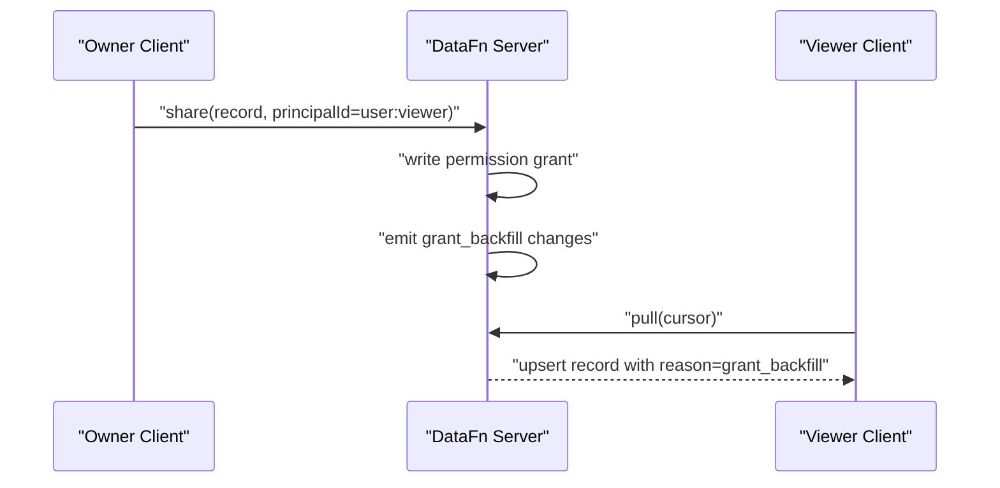
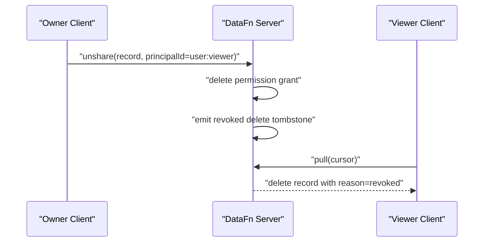

This page explains how sharing changes travel through sync when clients are offline and later reconnect.

## Lifecycle Overview

1. Owner creates or revokes a share grant.
2. Server records permission change and related visibility changes.
3. Clients pull incremental changes.
4. Newly allowed clients receive backfill upserts.
5. Revoked clients receive tombstones (delete entries).

## Sequence: Grant Backfill

## Sequence: Revoke Tombstone

## Push and Pull Rules

- **Push** still validates actor access before applying local mutations.
- **Pull** returns only actor-visible records for private shareable resources.
- **Clone** also respects actor-visible filtering.

## Offline Example

- Device A (owner) shares a note while Device B (viewer) is offline.
- Device B later reconnects and runs pull.
- Device B receives the historical note as a backfill upsert.
- If owner revokes later, Device B receives a delete tombstone on the next pull.

## Actor Feed

The **actor feed** is a dedicated change stream that tracks permission, membership, and hierarchy changes relevant to a specific actor. It is included in pull responses as the `actorFeed` array.

### Actor Feed Entry Types

| Type | Description |
| --- | --- |
| `permission_granted` | A new permission grant was created for one of the actor's effective principals. |
| `permission_revoked` | A permission grant was revoked for one of the actor's effective principals. |
| `membership_added` | The actor was added to a principal group. |
| `membership_removed` | The actor was removed from a principal group. |
| `hierarchy_changed` | A hierarchy edge was created or removed, potentially affecting the actor's effective principals. |

Each entry includes `serverSeq` (sequence number), and may include `principalId`, `resourceType`, and `resourceId` for context.

### How It Works

1. During pull, the server queries changes from three internal resources: `__datafn_permissions_global`, `__datafn_principal_memberships`, and `__datafn_principal_hierarchy`.
2. `buildActorFeedEffects()` filters these changes to only those affecting the requesting actor's effective principals.
3. Permission grants/revocations generate **visibility changes** — synthetic upserts or deletes injected into the pull response so the client sees records it gained or lost access to.
4. The actor feed cursor is tracked separately (key: `__datafn_actor_feed__`) to enable incremental delivery.

### Visibility Change Propagation

When a permission is granted:
- The server emits backfill upserts for all existing records the actor can now see.

When a permission is revoked:
- The server emits delete tombstones so the client removes records it can no longer access.

## Bounded K-Way Merge

When pulling changes from multiple resources, the server uses a **bounded k-way merge** (`mergeCanonicalChangeStreamsBounded`) to assemble the pull window without materializing a fully sorted global array.

- Each resource's change stream is sorted by `serverSeq`.
- The merge iterates across all streams, picking the smallest `serverSeq` at each step.
- The merge stops after `limit` entries, returning `hasMore: true` if changes remain.
- A `peakWindow` metric tracks the maximum number of active stream heads during the merge.

This ensures memory-safe pull assembly regardless of how many resources have pending changes.

## WebSocket Principal-Targeted Invalidation

When a mutation causes permission changes, the server broadcasts cursor updates to connected WebSocket clients.

- `broadcastCursor()` accepts an optional `affectedPrincipals` array.
- When `affectedPrincipals` is provided, only WebSocket clients whose authenticated principal matches one of the affected principals receive the cursor update (**targeted mode**).
- When `affectedPrincipals` is omitted or cannot be matched, all clients in the namespace are notified (**namespace-broadcast mode**).
- The broadcast result includes `mode` (`"targeted"` or `"namespace-broadcast"`), `degraded` flag, and `wokenClients` count.

This prevents unnecessary pull traffic for clients unaffected by the permission change.

## Failure Case (Forbidden Push)

If a viewer tries to push a write on an owner-only record:

- Server rejects mutation with `FORBIDDEN`.
- Pull remains consistent, and no unauthorized write appears in server state.
