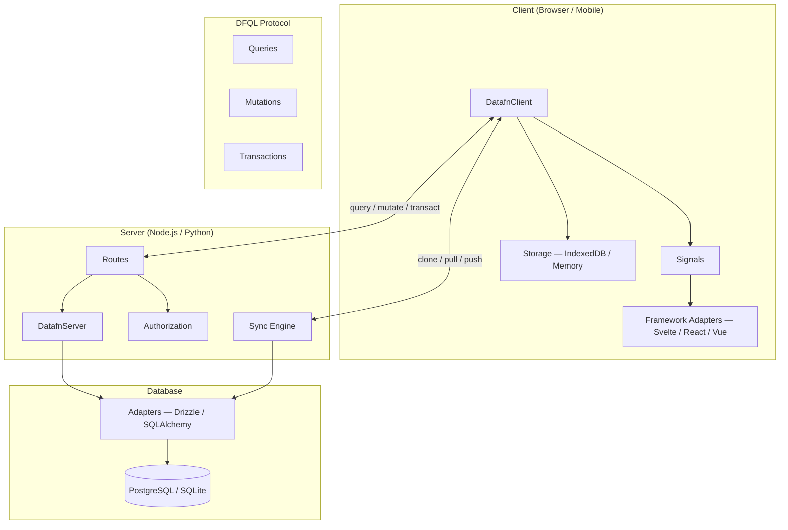

DataFn is a full-stack data management framework for building data-driven applications. It provides a unified approach to defining schemas, querying data, managing mutations, and synchronizing state between client and server.

## System Architecture

DataFn connects your client application to your server through DFQL, a structured query language. The client operates offline-first with local storage, syncing changes when online.

Select a section from the sidebar to get started.

----
Part of [Super functions](https://github.com/21nCo/super-functions) and built with care at [21n](https://21n.co).
