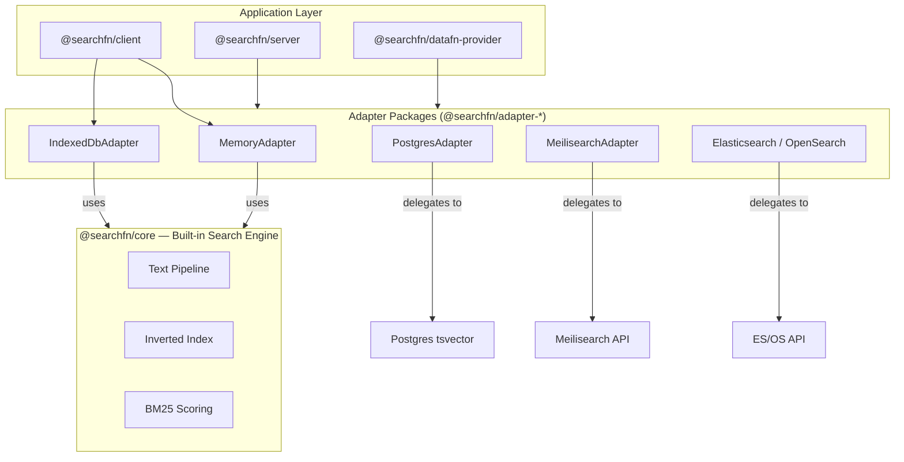

SearchFn has two core pieces: a **built-in search engine** (`@searchfn/core`) that handles tokenization, indexing, scoring, and ranking in-process, and an **adapter contract** (`SearchAdapter`) that provides a uniform interface across the built-in engine and external backends. Both tiers are production-ready — the built-in engine powers offline-first apps and in-process search, while external backends serve use cases that need shared state or backend-specific capabilities.

## Built-in Search Engine

The Memory and IndexedDB adapters are not thin wrappers — they run SearchFn's own full-text search engine, implemented in `@searchfn/core`. This is a complete search runtime comparable to libraries like FlexSearch or MiniSearch.

### Text Pipeline

Every document and query passes through a configurable text pipeline:

1. **Tokenize** — splits text into tokens using Unicode-aware regex (`[\p{L}\p{N}]+`)
2. **Normalize** — lowercases all tokens
3. **Stop words** — removes common words (built-in sets for English, Spanish, French)
4. **Stem** — reduces words to root forms (custom English stemmer; optional)
5. **Edge n-grams** — generates prefix tokens for autocomplete support (optional)

### Inverted Index

Documents are stored in an inverted index: each unique term maps to a posting list of `(docId, termFrequency)` pairs.

- **MemoryAdapter** stores postings in an in-memory `Map` keyed by `field::term`.
- **IndexedDbAdapter** stores postings in IndexedDB object stores with LRU caches for hot term lookups.

### BM25 Scoring

Search queries are scored using a BM25-inspired algorithm:

- **IDF** (inverse document frequency) — terms that appear in fewer documents score higher.
- **TF** (term frequency) — terms that appear more often in a document contribute more.
- **Length normalization** — shorter documents get a slight relevance boost.
- **Prefix penalty** — edge n-gram matches score lower than exact matches (0.7x multiplier).

### Fuzzy Matching

Fuzzy search uses Wagner-Fischer Levenshtein distance. When enabled, query terms are expanded against the vocabulary to find terms within the configured edit distance (max 3). Terms are pre-filtered by length difference for performance.

### Field Boosts

The built-in engine supports per-field relevance boosting — for example, weighting `title` matches higher than `description` matches.

## Package Layers



| Layer | Package | Responsibility |
| --- | --- | --- |
| Engine | `@searchfn/core` | Text pipeline, inverted index, BM25 scoring, fuzzy matching, stemming |
| Contracts | `@searchfn/adapter-contracts` | Shared `SearchAdapter` contract, request/response params, and capability types |
| Adapters | `@searchfn/adapter-memory`, `@searchfn/adapter-indexeddb`, `@searchfn/adapter-postgres`, `@searchfn/adapter-meilisearch`, `@searchfn/adapter-elasticsearch`, `@searchfn/adapter-opensearch` | Adapter implementations. Memory and IndexedDB use the built-in engine; Postgres, Meilisearch, and ES/OS delegate to external backends. |
| Client | `@searchfn/client` | Validates inputs, applies defaults, and delegates to an adapter |
| Server | `@searchfn/server` | Validates HTTP requests, runs authorization, delegates to an adapter, and returns canonical response envelopes |
| Integration | `@searchfn/datafn-provider` | Maps a `SearchAdapter` into a DataFn `SearchProvider` |

## Adapter Contract

`SearchAdapter` is the boundary between application code and search implementation. Every adapter — built-in or external — implements this interface:

```typescript
interface SearchAdapter {
  readonly name: string;
  readonly capabilities?: SearchAdapterCapabilities;

  initialize?(params: InitializeParams): Promise<void>;
  index(params: IndexParams): Promise<void>;
  search(params: SearchParams): Promise<Array<string | number>>;
  searchAll?(params: SearchAllParams): Promise<SearchAllResult[]>;
  remove(params: RemoveParams): Promise<void>;
  clear(resource: string, signal?: AbortSignal): Promise<void>;
  dispose?(): Promise<void>;
}
```

| Method | Required | Description |
| --- | --- | --- |
| `initialize` | Optional | Declare resources and their searchable fields before indexing |
| `index` | Yes | Index a batch of documents into a resource |
| `search` | Yes | Search a single resource, returns matching IDs |
| `searchAll` | Optional | Search across multiple resources, returns IDs with scores |
| `remove` | Yes | Remove documents by ID from a resource |
| `clear` | Yes | Remove all documents from a resource |
| `dispose` | Optional | Release resources (connections, caches, handles) |

### Capabilities

Adapters declare their capabilities so clients and servers can adapt behavior:

```typescript
interface SearchAdapterCapabilities {
  persistent?: boolean;
  searchAll?: boolean;
  fuzzy?: boolean;
  fieldBoosts?: boolean;
  maxBatchSize?: number;
}
```

| Capability | Description |
| --- | --- |
| `persistent` | Data survives process restarts (IndexedDB, Postgres, Meilisearch, Elasticsearch) |
| `searchAll` | Adapter natively supports cross-resource search |
| `fuzzy` | Adapter supports fuzzy/approximate matching |
| `fieldBoosts` | Adapter supports per-field relevance boosting |
| `maxBatchSize` | Maximum documents per `index` call |

## Response Envelope

The server wraps all responses in a canonical envelope:

**Success:**
```json
{
  "ok": true,
  "result": { "ids": ["t-1", "t-3"] }
}
```

**Failure:**
```json
{
  "ok": false,
  "error": {
    "code": "DFQL_INVALID",
    "message": "Query must be a non-empty string",
    "details": { "path": "query" }
  }
}
```

### Error Codes

| Code | Meaning |
| --- | --- |
| `DFQL_INVALID` | Malformed request or missing required fields |
| `LIMIT_EXCEEDED` | Query, limit, or batch size exceeds configured maximums |
| `DFQL_ABORTED` | Request was cancelled via AbortSignal |
| `DFQL_UNSUPPORTED` | Adapter does not support the requested operation or dialect |
| `FORBIDDEN` | Authorization callback denied the request |
| `INTERNAL` | Unexpected backend or runtime failure |

## Data Flow

### Built-in engine (Memory / IndexedDB)

1. **Pipeline** — text is tokenized, normalized, filtered for stop words, and stemmed.
2. **Index** — terms are inserted into the inverted index with term frequencies.
3. **Search** — query text passes through the same pipeline, optional fuzzy expansion runs against the vocabulary, postings are retrieved, and BM25 scoring produces ranked results.

### External backends (Postgres / Meilisearch / ES)

1. **Validation** — client or server validates the request shape and limits.
2. **Authorization** — server checks the `authorize` callback (if configured).
3. **Delegation** — the request is translated into the backend's native API.
4. **Response** — backend results are mapped back to SearchFn's response format.

For `searchAll`, if the adapter does not implement `searchAll` natively, the client and datafn-provider run per-resource searches concurrently and merge results with deterministic score-based ordering.
