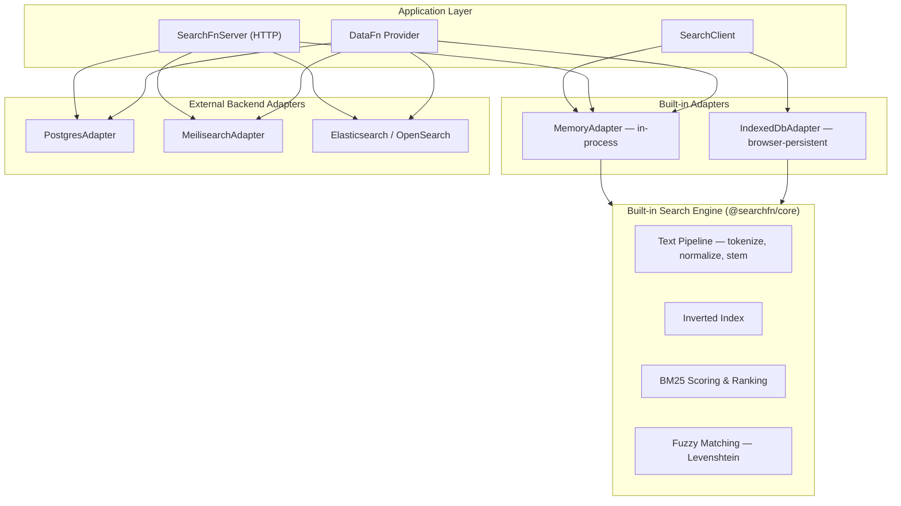

SearchFn is a full-text search engine for TypeScript applications. It ships its own search runtime — with BM25 scoring, inverted indexes, fuzzy matching, stemming, and a configurable text pipeline — that runs in-memory or in the browser via IndexedDB. The same adapter contract also connects to Postgres, Meilisearch, or Elasticsearch/OpenSearch, so you can choose the right runtime for your use case without changing application code.

## System Architecture

SearchFn has two layers: a **built-in search engine** that handles indexing, tokenization, and ranking in-process, and **backend adapters** that delegate to external search services.

SearchFn is composed of four packages:

| Package | Purpose |
| --- | --- |
| `@searchfn/core` | Built-in search engine — text pipeline, inverted index, BM25 scoring, fuzzy matching, stemming |
| `@searchfn/adapter-contracts` | Shared adapter interface and request/response types |
| `@searchfn/adapter-memory` / `@searchfn/adapter-indexeddb` | Built-in engine adapters (in-process + browser-persistent) |
| `@searchfn/adapter-postgres` / `@searchfn/adapter-meilisearch` / `@searchfn/adapter-elasticsearch` / `@searchfn/adapter-opensearch` | External backend adapters |
| `@searchfn/client` | Client with validation, defaults, and convenience constructors |
| `@searchfn/server` | HTTP server with authorization, structured logging, and secret redaction |
| `@searchfn/datafn-provider` | Bridge that maps any SearchAdapter into a DataFn SearchProvider |

## Built-in Engine vs External Backends

| | Built-in engine (Memory, IndexedDB) | External backends (Postgres, Meilisearch, ES/OS) |
| --- | --- | --- |
| **Search logic** | SearchFn's own BM25 scoring, inverted index, fuzzy matching, stemming | Delegates to the backend's native search |
| **Infrastructure** | Zero — runs in-process or in the browser | Requires running the external service |
| **Use cases** | Offline-first apps, PWAs, browser-local search, in-process server search, tests | Multi-client shared search, very large datasets, backend-specific features (facets, custom analyzers) |

Both tiers are production-ready. The built-in engine powers offline-first apps and in-process search; external backends serve use cases that need shared state across clients or backend-specific capabilities. The adapter contract means you pick the right runtime for your requirements without changing application code.

## Next Steps

- [Getting Started](/docs/getting-started) — install packages and run your first search in minutes.
- [Architecture](/docs/architecture) — search engine internals, package layers, and adapter contract.
- [Client API](/docs/reference/client) — client constructors, methods, and validation.
- [Server API](/docs/reference/server) — HTTP endpoints, authorization, and limits.
- [Adapters](/docs/reference/adapters) — choose the right adapter for your use case.
- [DataFn Integration](/docs/integrations/datafn) — connect SearchFn to DataFn.
- [Operations](/docs/operations/setup) — deployment, security, observability, and troubleshooting.

----
Part of [Super functions](https://github.com/21nCo/super-functions) and built with care at [21n](https://21n.co).
